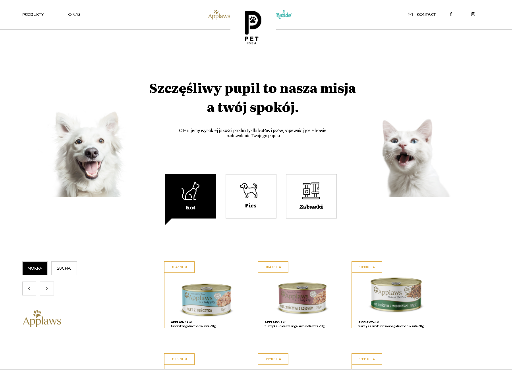

# PetShop E-Commerce Website

This project is an e-commerce website designed for pet owners, developed in collaboration with a professional graphic designer in Figma for a real customer in Poland. Although the customer resigned from the project just before its production launch, I have retained this project as a portfolio piece to showcase my work and the skills I've gained throughout its development.

## Table of Contents

- [Project Overview](#project-overview)
- [Features](#features)
  - [Navigation](#navigation)
  - [Food Gallery](#food-gallery)
  - [About Section](#about-section)
  - [Contact Section](#contact-section)
- [Technology Stack](#technology-stack)
- [Learning Outcomes](#learning-outcomes)
- [Installation](#installation)

## Project Overview


The PetShop website offers a selection of food products and toys for dogs and cats. The purchasing method is unique, requiring customers to send the product code via a contact form or direct email, ensuring accuracy in order placement.

## Features

### Navigation

- **Fixed Position Navigation**: The navigation section is fixed, ensuring it remains visible as users scroll.
- **Dynamic Logo**: The shop logo (black in the middle) reduces in size and changes position as the user scrolls down and reverts to its original state when scrolled back to the top.
- **Responsive Burger Menu**: On devices with a width less than 480px, the navigation menu transforms into a burger menu for better usability.

### Food Gallery

- **Categorized Display**: The gallery categorizes products into wet and dry food for both dogs and cats. Selecting an animal and food category filters the gallery to display the appropriate products.
- **Responsive Design**: The gallery displays 6 product images at a time on desktop (width 480px and above) and 1 product image at a time on mobile devices (less than 480px width).
- **Navigation Arrows**: Users can navigate between products using arrows. The navigation is disabled at the beginning and end of the product list to prevent errors.
- **Product Logo Sync**: The product logo below the arrows updates to match the currently displayed product images.

### About Section

- **Company Description**: An informative section providing details about the company.

### Contact Section

#### Form Validation

- **Client-Side Validation**: Inputs are validated upon submission, highlighting missing or incorrect fields with a light red background and red bottom border.
- **Placeholders**: Inputs include placeholders only, without labels for a cleaner design.

#### Form Submission

- **Email Submission**: Form submissions are sent to the website owner's email using Node.js with Nodemailer, Body Parser, and Express.
- **SMTP Integration**: Emails are sent using SMTP, with all sensitive data securely stored in a `.env` file using Dotenv.
- **Server-Side Validation**: The form undergoes server-side validation to ensure all fields are correctly filled, mirroring client-side validation.
- **Error Handling**: Users receive toast messages for server errors or internet connection issues.
- **Submission Animation**: An animation is displayed during form submission, disappearing upon receiving a response.

### General

- **Responsive Design**: The website is fully responsive and works on all devices.
- **Webpack Configuration**: The project uses Webpack for bundling.

## Technology Stack

- **Frontend**: HTML, CSS, JavaScript
- **Backend**: Node.js, Express, Nodemailer
- **Build Tool**: Webpack
- **Environment Variables**: Dotenv

## Learning Outcomes

This project was a significant learning experience, allowing me to develop and refine skills in web development, responsive design, form validation, and server-side processing. Despite the client's unexpected resignation, the project stands as a testament to my dedication and capability in delivering professional-grade web solutions.

## Installation

### Prerequisites

- Ensure you have Node.js and npm installed on your machine.

### Steps

1. **Clone the Repository**:

   ```shell
   git clone https://github.com/radek-drw/pet-idea.git
   cd pet-idea-shop
   ```

2. **Install dependencies**:

   ```shell
   npm install
   ```

3. **Set Up Environment Variables**:

   Create a [`.env`] file in the root directory and add your API keys:

   ```env
   SMTP_HOST=your_smtp_host
   SMTP_PORT=your_smtp_port
   SMTP_USER=your_user_name
   SMTP_PASS=your_password
   ```

4. **Start the Development Server**:

   ```shell
   npm start
   ```

   This will start the development server and open the website in your default browser.

5. **Build for Production**:

   ```shell
   npm run build
   ```

This will create an optimized production build in the dist folder.

## License

This project is open source and available under the MIT License.

## Contact

If you have any questions or feedback, feel free to contact me at [rdrweski@gmail.com].
